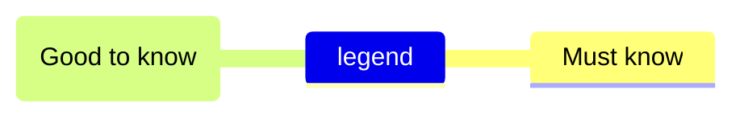
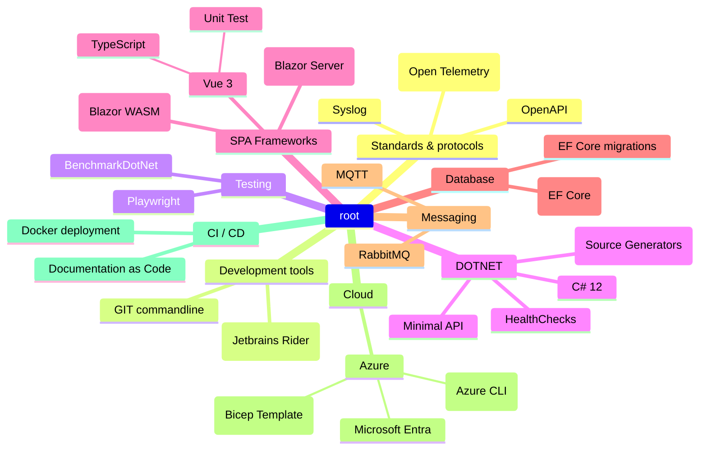

### Hi there 👋
I'm a software engineer who is passionate about creating software and extending technologies that can help in any way possible. Some technologies I enjoy working with include DotNet, Vue, Blazor, SVG, and many others. Underneath I created a personal roadmap

