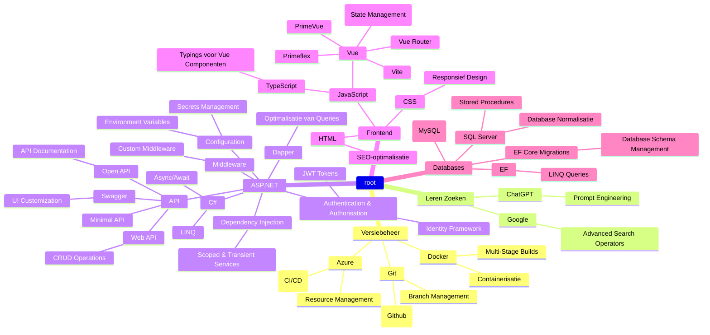

### POP/Mindmap 8-11-2024 👋

    Versiebeheer
        Git: Een gedistribueerd versiebeheersysteem voor het bijhouden van wijzigingen in code en samenwerking binnen ontwikkelteams.
            (Github): Een platform voor het hosten van Git-opslagplaatsen en samenwerking aan code met tools zoals pull requests en projectbeheer.
        Docker: Een platform voor het ontwikkelen, verzenden en uitvoeren van toepassingen in containers, waardoor consistentie wordt gegarandeerd tussen verschillende omgevingen.
        Azure: Cloudservice van Microsoft voor het hosten van toepassingen, databases en AI-diensten, met opties voor CI/CD-implementatie en resourcebeheer.

    Leren Zoeken
        ChatGPT: Een op AI gebaseerd taalmodel dat in staat is mensachtige tekst te genereren op basis van de input die het ontvangt.
        Google: Een veelgebruikte zoekmachine voor het vinden van informatie op internet.

    ASP.NET: Een framework voor het bouwen van webtoepassingen en -services met behulp van .NET.
        C#: Een programmeertaal die veel wordt gebruikt voor het ontwikkelen van toepassingen op het .NET-platform.
        Dapper: Een lichtgewicht Object-Relational Mapping (ORM) -bibliotheek voor .NET die wordt gebruikt om database-objecten te koppelen aan .NET-objecten.
        Middleware: Componenten die verzoeken en antwoorden afhandelen in de ASP.NET-pijplijn, waardoor overkoepelende zorgen kunnen worden aangepakt.
        Dependency Injection: Een ontwerppatroon dat wordt gebruikt om objecten van hun afhankelijkheden te voorzien, wat losse koppeling en eenvoudiger testen bevordert.
        Configuratie: Beheer van toepassingsinstellingen en parameters in ASP.NET-toepassingen.
        Authenticatie en Autorisatie: Het implementeren van beveiligingsfuncties om toegang tot bronnen in ASP.NET-toepassingen te regelen.
        API: Application Programming Interface voor het bouwen en consumeren van webservices.
            Web API: Een framework voor het bouwen van HTTP-services die een breed scala aan clients kunnen bereiken, waaronder browsers en mobiele apparaten.
            Minimal API: Een lichte benadering voor het bouwen van HTTP-API's met minimale overhead in ASP.NET Core.
            Open API: Een specificatie voor het bouwen en documenteren van RESTful API's.
            Swagger: Een tool voor het documenteren en interageren met API's met behulp van een OpenAPI-specificatie.

    Frontend: Het gebruikersgerichte deel van een webtoepassing.
        HTML: Hypertext Markup Language gebruikt voor het structureren van webpagina's.
        CSS: Cascading Style Sheets gebruikt voor het vormgeven van webpagina's.
        JavaScript: Een programmeertaal die wordt gebruikt voor het toevoegen van interactiviteit en dynamisch gedrag aan webpagina's.
            Vue: Een progressief JavaScript-framework voor het bouwen van gebruikersinterfaces.
                PrimeVue: Een componentenbibliotheek voor Vue met kant-en-klare UI-elementen zoals knoppen, tabellen en modals, die het ontwikkelen van gebruikersinterfaces vereenvoudigt.
                Primeflex: Een CSS-utility-bibliotheek die flexibele, responsieve lay-outs mogelijk maakt door gebruik te maken van eenvoudige klassevoorbeelden voor layout-aanpassingen.
            TypeScript: Een uitbreiding van JavaScript die statische typering en andere functies aan de taal toevoegt.

    Databases: Systemen voor het opslaan, beheren en ophalen van gegevens.
        SQL Server: Een relationeel databasebeheersysteem ontwikkeld door Microsoft.
        (MySQL): Een open-source relationeel databasebeheersysteem.
        EF: Entity Framework, een ORM-framework voor .NET dat databaseprogrammering vereenvoudigt.
        EF Core Migrations: Het beheren van wijzigingen in het databaseschema in Entity Framework Core.
